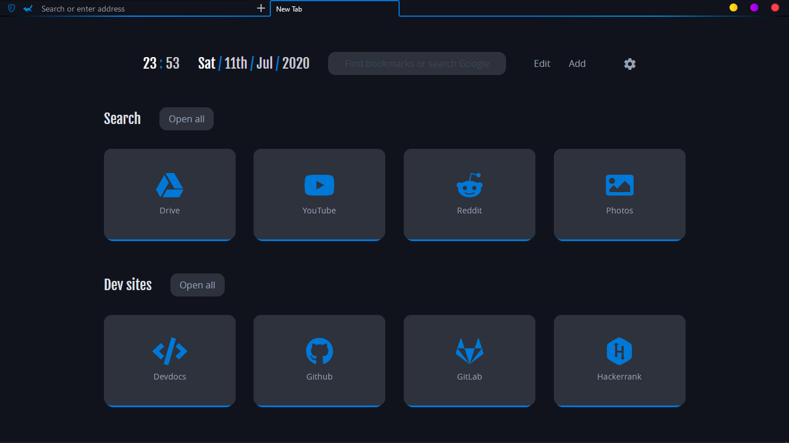
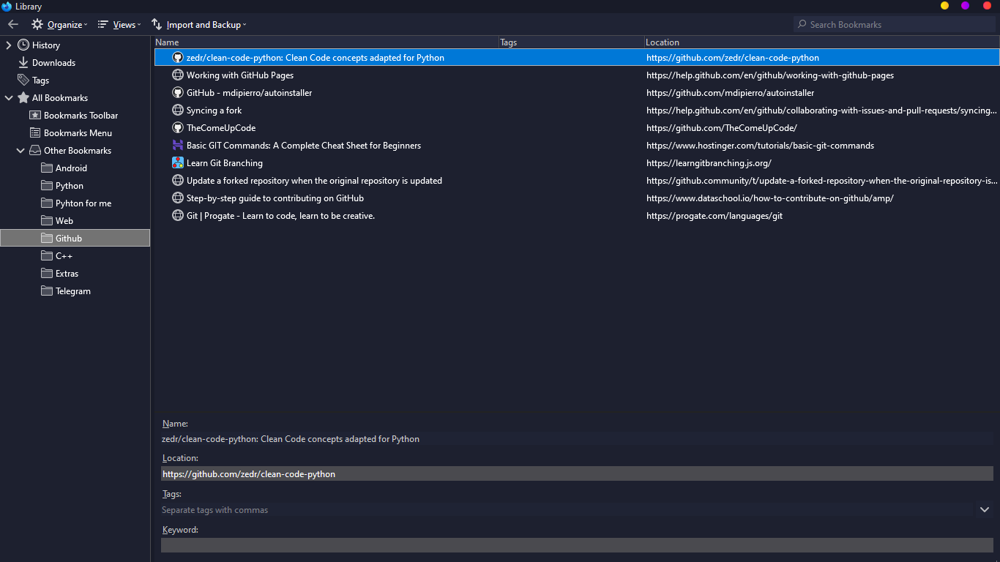

THIS IS WHAT I USE AS MY FIREFOX THEME.
___
## userChrome.css
This helps to customize Firefox User Interface. Place this file in your Firefox chrome folder.
___
## userChrome.xml and userChrome.js
Used for scrollbars. Place these files in your Firefox chrome folder.

Note: In firefox 72+ they may not work because Firefox removed the `xbl` support
___
## userContent.css 
This helps to customize Firefox web content. Place this file in your Firefox chrome folder.
___
## userColors.css 
Made for defining colors based on dark theme and light theme. Place this file in your Firefox chrome folder.
___
## Credits
- This guy helped me a lot on [r/FirefoxCSS](https://www.reddit.com/r/FirefoxCSS/) : [r/It_Was_The_Other_Guy](https://www.reddit.com/user/It_Was_The_Other_Guy)

- I started with this amazing material theme : [MaterialFox](https://github.com/muckSponge/MaterialFox) by [muckSponge](https://github.com/muckSponge)

- One of the best dark theme for Firefox : [ShadowFox](https://overdodactyl.github.io/ShadowFox) by [overdodactyl](https://github.com/overdodactyl)

[Theme inspiration](https://www.reddit.com/r/FirefoxCSS/comments/ci7i69/another_oneline_theme/)
___
## Previews

Library

___
## ARIGATOU
