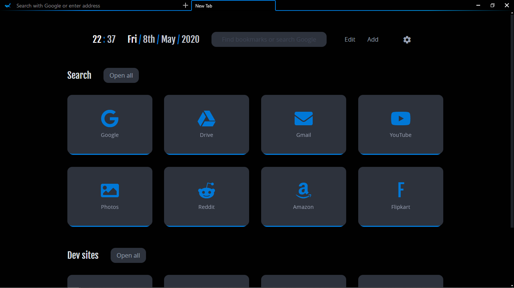
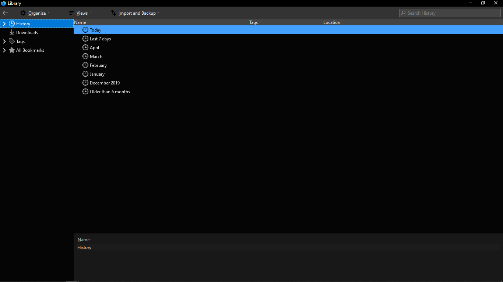

THIS IS WHAT I USE IN MY CHROME FOLDER. TWEAKS ARE IN OTHER REPO.

## userChrome.css
This helps to customize Firefox User Interface. Place this file in your Firefox chrome folder.

## userChrome.xml and userChrome.js
Used for scrollbars. Place these files in your Firefox chrome folder.

Note: In current firefox version 70+ they may not work

## userContent.css 
This helps to customize Firefox web content. Place this file in your Firefox chrome folder.

___
## Previews

