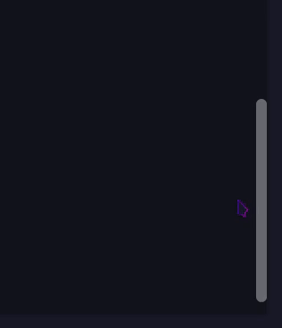
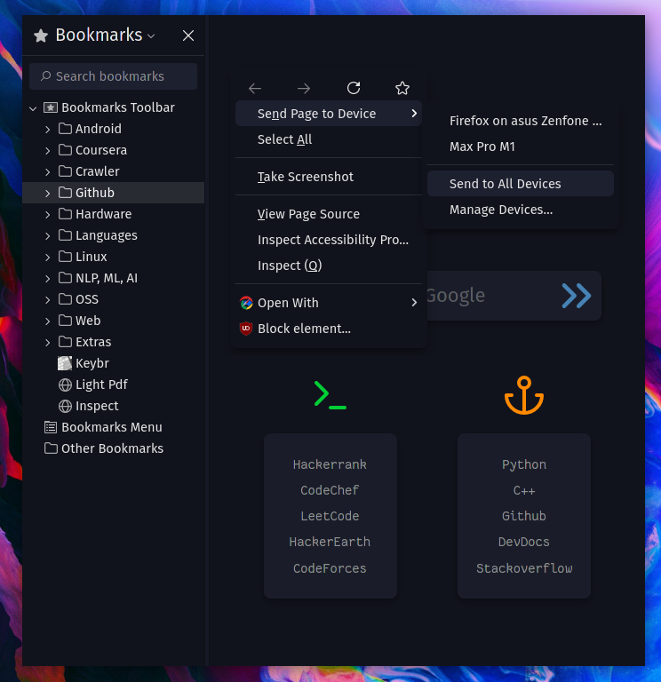
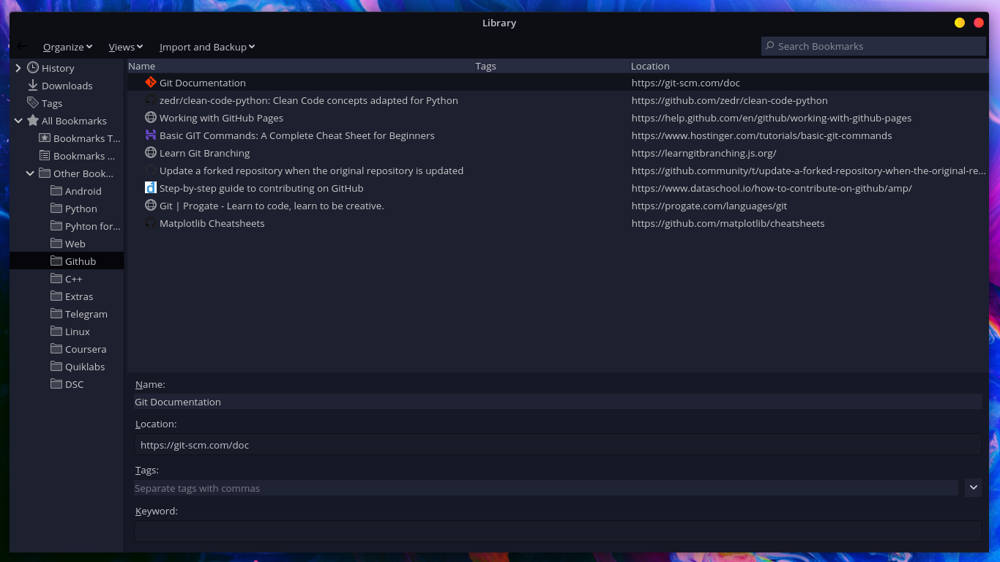

<h1 align="center">Sweet_Pop!</h1>

<p align="center"></p>

<h3 align="center">Floating Navigation</h3>
<p align="center"></p>

<h3 align="center">Auto-hide Scrollbars</h3>
<p align="center"></p>

<h3 align="center">Context Menu</h3>
<p align="center"></p>

<h3 align="center">Library</h3>
<p align="center"></p>

## Folder structure

 .<br>
├──  assets<br>
│  ├──  context.png<br>
│  ├──  library.png<br>
│  ├──  navbar.gif<br>
│  ├──  preview.png<br>
│  └──  scrollbar.gif<br>
├──  icons<br>
│  ├──  back.svg<br>
│  ├──  close.svg<br>
│  ├──  close_hover.svg<br>
│  ├──  closew.svg<br>
│  ├──  fox-transparent.gif<br>
│  ├──  home.svg<br>
│  ├──  infoico.png<br>
│  ├──  max_hover.svg<br>
│  ├──  max_restore.svg<br>
│  ├──  min.svg<br>
│  ├──  min_hover.svg<br>
│  ├──  reload.svg<br>
│  ├──  restore_hover.svg<br>
│  ├──  search.svg<br>
│  ├──  sonic.gif<br>
│  ├──  tab-loading.png<br>
│  └──  welcome-back.svg<br>
├──  LICENSE<br>
├──  programs<br>
│  ├──  local-settings.js<br>
│  └──  mozilla.cfg<br>
├──  README.md<br>
├──  script<br>
│  ├──  appMenuAboutConfigButton.uc.js<br>
│  ├──  hideScrollbar.uc.js<br>
│  └──  navbarToolbarButtonSlider.uc.js<br>
├──  userChrome.css<br>
├──  userContent.css<br>
└──  utils<br>
   ├──  boot.jsm<br>
   └──  chrome.manifest<br>

### [`userChrome.css`](./userChrome.css)
This helps to customize Firefox User Interface.

### [`userContent.css`](./userContent.css)
This helps to customize web content like a specific site.

### [`hideScrollbar.uc.js`](./script/hideScrollbar.uc.js)
It's now possible to autohide scrollbars.

### [`appMenuAboutConfigButton.uc.js`](./script/appMenuAboutConfigButton.uc.js)
Adds `about:config` as `Advanced Preferences` button in the App menu settings.

### [`navbarToolbarButtonSlider.uc.js`](./script/navbarToolbarButtonSlider.uc.js)
As this is a one-liner theme, one must drop some buttons to add sufficient space for urlbar and tabbar. That's why I mentioned in [issue 2](https://github.com/PROxZIMA/Firefox-Theme/issues/2) to move the add-ons to overflow menu. But this messed up with their widths. Take a look [here](https://www.reddit.com/r/FirefoxCSS/comments/n9asta/addons_width_changes_to_a_fixed_value_when_placed/). I did some temporary fix(which was not that good). But [u/MotherStylus](https://www.reddit.com/user/MotherStylus) came up with an awesome `uc.js` script.<br>
So basically this adds a button slider to navbar toolbar. [This](https://raw.githubusercontent.com/PROxZIMA/Firefox-Theme/master/assets/navbar.gif) is how it looks. Read the file description to configure it properly.

## **But how does it work?**
Custom startup-script (aka [`mozilla.cfg`](./programs/mozilla.cfg) here) is loaded using [`local-settings.js`](./programs/local-settings.js). This startup-script adds "loader" scripts from `utils` folder that loads arbitrary javascript files from the `script` folder into Firefox<br>
`mozilla.cfg` also helps in setting local webpage as your homepage. Details in [Install](#Install).

NOTE: Firefox team has removed XBL from Firefox starting with version 72, so userChrome.js would not work :/

## Install
1) In `about:config` make sure that following `Perf name` has respective `Value`

| Pref name 	| Type 	| Value 	|
|-	|-	|-	|
| toolkit.legacyUserProfileCustomizations.stylesheets 	| Boolean 	| `true` 	|
| svg.context-properties.content.enabled 	| Boolean 	| `true` 	|
| browser.compactmode.show 	| Boolean 	| `true` 	|

2) Open `about:support` in new tab and click `Open Directory` near `Profile Directory`.

3) Open this directory in terminal and clone the repository

Note: If you already have a `chrome` folder under `Profile Directory`, rename it to `chrome2` or anything else so that after trying this theme you can easily restore your theme.

```console
$ cd {Your profile directory}

$ git clone https://github.com/PROxZIMA/Firefox-Theme.git chrome

$ cd chrome
```

NOTE: If you are planning to set a local page as home page then in [`mozilla.cfg`](./programs/mozilla.cfg) at line 13 change `newTabURL_` to the local page location

4) Move `mozilla.cfg` and `local-settings.js` to their destination.

<details><summary>Linux / OS X</summary>
<br>

On `about:support` > `Application Binary` > `{Installation folder}firefox-bin`<br>
My `Installation folder` is `/opt/firefox-nightly/`. Generally it is `/usr/lib/firefox/`

```console
$ cp ./programs/mozilla.cfg /usr/lib/firefox/

$ cp ./programs/local-settings.js /usr/lib/firefox/defaults/pref/
```
</details>

<details><summary>Windows</summary>
<br>

On `about:support` > `Application Binary` > `{Installation folder}firefox.exe`<br>
Generally `Installation folder` is `C:\Program Files\Mozilla Firefox\`

```powershell
> move .\programs\mozilla.cfg "C:\Program Files\Mozilla Firefox\"

> move .\programs\local-settings.js "C:\Program Files\Mozilla Firefox\defaults\pref\"
```
</details>

5) In Firefox, right click hamburger button > `customize toolbar` disable `Title Bar`, `Drag Space`, set Density to `compact` and Themes to `dark` or `light`

6) Open `about:support` > `Clear startup cache...` > `Restart`<br>`Restart` again

7) **Voilà**

## Tips
1) To disable floating toolbox, comment lines 40-44 in `userChrome.css`
2) To disable any of the `script/*.uc.js`, simply rename `script.uc.js` to `script`.
3) You can also edit `hideScrollbar.uc.js` to customize the scrollbars according to your taste.
4) You can change theme to `Light` from the customize page
5) If something breaks on your system then do `git pull origin master` in your chrome folder.

## Credits
- I started with this amazing material theme : [MaterialFox](https://github.com/muckSponge/MaterialFox) by [muckSponge](https://github.com/muckSponge)

- One of the best dark theme for Firefox : [ShadowFox](https://overdodactyl.github.io/ShadowFox) by [overdodactyl](https://github.com/overdodactyl)

- Floating Toolbox : [u/oldworlds](https://www.reddit.com/r/FirefoxCSS/comments/koa71w/minimalfox_a_compact_and_minimal_theme/)

- [Theme inspiration](https://www.reddit.com/r/FirefoxCSS/comments/ci7i69/another_oneline_theme/) by [u/SENDMEJUDES](https://www.reddit.com/user/SENDMEJUDES/)

- [u/It_Was_The_Other_Guy](https://www.reddit.com/user/It_Was_The_Other_Guy) helped me a lot on [r/FirefoxCSS](https://www.reddit.com/r/FirefoxCSS/)<br>
Also this theme uses his [fx-autoconfig](https://github.com/MrOtherGuy/fx-autoconfig) to load the javascripts files.

- [`navbarToolbarButtonSlider.uc.js`](https://github.com/aminomancer/uc.css.js) script by [u/MotherStylus](https://www.reddit.com/user/MotherStylus) adds button slider to navbar toolbar. More details [here](https://www.reddit.com/r/FirefoxCSS/comments/n9asta/addons_width_changes_to_a_fixed_value_when_placed/)

- [`appMenuAboutConfigButton.uc.js`](https://github.com/aminomancer/uc.css.js) script by [u/MotherStylus](https://www.reddit.com/user/MotherStylus).

- [Setting local page as homepage](https://www.reddit.com/r/firefox/comments/ge86z4/newtab_page_to_local_file_firefox_76_redux/)

- Auto hide scrollbars : details [here](https://www.reddit.com/r/FirefoxCSS/comments/jptrf8/is_it_still_possible_to_autohide_and_show/) by [u/mimecry](https://www.reddit.com/user/mimecry/)

- My favorite [startpage](https://www.reddit.com/r/startpages/comments/hfuoqg/a_simple_startpage_i_have_been_working_on/)

___
<p align="center">Made with ❤️</p>
<h2 align="center">ARIGATOU</h2>
